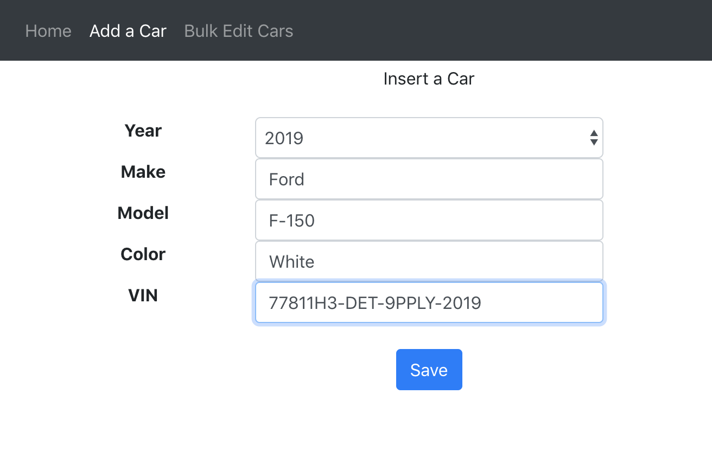
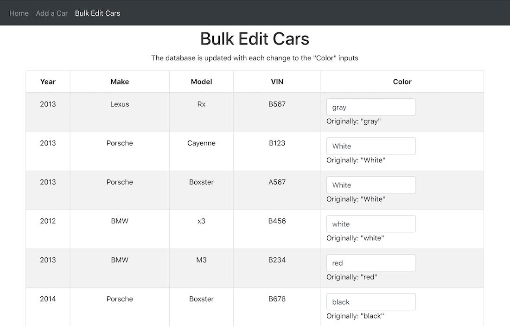

# Cars

Adding a car | Bulk Editing Cars
--- | --- 
 |

This project was for the Full Stack Developer bootcamp I did and was for a lesson on connecting a React / Express application to MongoDB.

## The assignment

> * Create a full stack web application in a project directory called “task 6”. Create the back-end of the application using Express and the front-end using React. You should create a mongoDB that stores information about cars in a collection called cars.
> * Your application should allow one to:
> > * Add a car to the cars collection.
> > * Update information about a single car.
> > * Update information about more than one car.
> > * Delete a specific document.
> > * List all the information for all cars in your database.
> > * List model, make, registration number and current owner for all cars older than 5 years.
>
> * Ensure that for the back-end of your application you:
> > * Install Mongoose.
> > * Create 2 directories in your project directory called “models” and “controllers”.
> > * Write all the code needed to perform the necessary CRUD operations for your application.

<!-- ## Demo
Update when hosted somewhere -->

## Running the Code Locally

[Clone / Download](https://github.com/dh4u/bootcamp-cars.git) the project to your computer.

### Start the code
Open command prompt / terminal for the project folder and then you can run:

#### `npm install`

This will install the node dependencies.

#### `npm start`

Runs the app in the development mode. 
Open [http://localhost:3000](http://localhost:3000) to view it in the browser.
 
 

***
###### This project was bootstrapped with [Create React App](https://github.com/facebook/create-react-app).
